# 🏴Hanoi Tower

## 1️⃣ Process

### 🤔 사례 : 원반 3개 옮기기

|    0단계    |    1단계    |
| :---------: | :---------: |
| 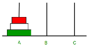 | 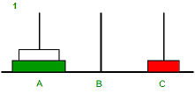 |

|    2단계    |    3단계    |
| :---------: | :---------: |
| 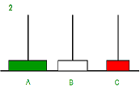 | 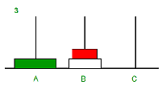 |

|    4단계    |    5단계    |
| :---------: | :---------: |
| 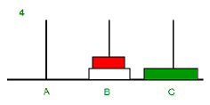 | 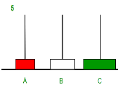 |

|    6단계    |    7단계    |
| :---------: | :---------: |
| 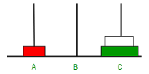 | 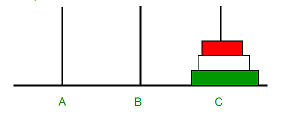 |

```
✔ 이동 횟수 : 7회
```

<br>

### 🤔 일반화 : 원반 n개 옮기기

|    1단계    |     2단계     |
| :---------: | :-----------: |
| 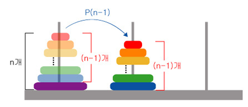 | 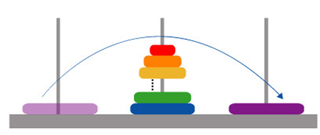 |

|     3단계     | 종료 |
| :-----------: | :--: |
| 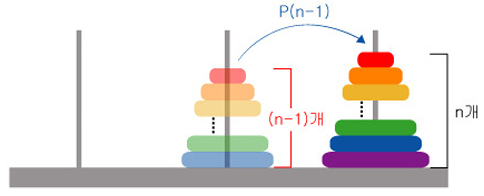 | 종료 |

## 2️⃣ Recurrence Relation

$\mathbb{P_n}=2 *\mathbb{P_{(n-1)}}+1$<br>
$\mathbb{P_n}+1=2\mathbb{P_{(n-1)}}+1+1=2[\mathbb{P_{(n-1)}}+1]$

<br>

<br>
$\mathbb{P_{n-1}}$ : `n-1`개 원반 모두 다른 곳으로 옮기기

<br>
1 : 1개를 다른 곳으로 옮기기

<br>
$\mathbb{P_{n-1}}$ : `n-1`개 원반 모두 다른 곳으로 옮기기
<br>
<br>

### ✔ Recurrence Formula

$\mathbb{P_n}= \mathbb{P_{(n-1)}}+1+\mathbb{P_{(n-1)}}$<br>
$\mathbb{P_n}=2 *\mathbb{P_{(n-1)}}+1$<br>
<br>
<br>

## 3️⃣ Genral Term

<br>

### 하노이탑 최소 이동 횟수는 계차수열 !!

<br>

```
⭐Difference Seqeuce (계차 수열)⭐
 Difference of the current and previous terms has pattern
```

<br>

**하노이탑의 이동 횟수 구하기**<br>

$\mathbb{P_1}=1$<br>
$\mathbb{P_2}=1+1+1=3$<br>
$\mathbb{P_3}=3+1+3=7$<br>
$\mathbb{P_4}=7+1+7=15$<br>
$\mathbb{P_5}=15+1+15=31$<br>

<br>

**계차 수열 여부 확인**<br>

$\mathbb{P_2}-\mathbb{P_1}=2$<br>
$\mathbb{P_3}-\mathbb{P_2}=4$<br>
$\mathbb{P_4}-\mathbb{P_3}=8$<br>
$\mathbb{P_5}-\mathbb{P_4}=16$<br>

✔ 계차가 공비가 2인 등비 수열 이룸

<br>

**계차 수열 일반항 구하기**
<br>
등비수열의 합 공식 이용<br>

<br>

$\mathbb{P_n}+1=2*(\mathbb{P_{n-1}}+1)$<br>
$\mathbb{P_{n-1}}+1=2*(\mathbb{P_{n-2}}+1)$<br>
$\mathbb{P_{n-2}}+1=2*(\mathbb{P_{n-3}}+1)$<br>
...<br>
$\mathbb{P_{2}}+1=2*(\mathbb{P_{1}}+1)$<br>

<br>
좌변은 좌변끼리, 우변은 우변끼리 곱하기

$(\mathbb{P_n}+1)*(\mathbb{P_{n-1}+1)*(\mathbb{P_{n-2}}+1) ... (\mathbb{P_2}+1)}$ = $\mathbb{2^{n-1}}*(\mathbb{P_{n-1}+1)*(\mathbb{P_{n-2}}+1) ... (\mathbb{P_2}+1)}*(\mathbb{P_1+1})$

<br>
양변에 나눗셈을 이용한 동류항 정리<br>

$\mathbb{P_n}+1 =\mathbb{2^{n-1}} * (\mathbb{P_1+1})$

<br>

$\mathbb{P_n}=1$ 대입

$\mathbb{P_n}+1 =\mathbb{2^{n-1}} * (1+1)$ <br>
$\mathbb{P_n}+1 =\mathbb{2^{n-1}} * 2 = \mathbb{2^{n}}$ <br>

<br>

### ✔ 하노이탑 최소 이동 횟수 : 일반항 도출

<br>

$\mathbb{P_n} =\mathbb{2^{n-1}} * 2 = \mathbb{2^{n}}-1$ <br>
<br>

## 4️⃣ 재귀적 코드 구현

<br>

```python
MOVE_MESSAGE = "{}번 원반을 {}에서 {}로 이동"


def move(N, start, destination):
    print(MOVE_MESSAGE.format(N, start, destination))


def hanoi(n, start, destination, via):
    """
    하노이의 탑 규칙에 따라 원반을 옮기고,
    옮길 때마다 원반의 시작 위치와 이동한 위치를 출력
    마지막으로 총 이동 횟수를 반환
    :params
        n: 총 원반 개수
        start: 시작 기둥
        destination: 도착 기둥
        via: 보조 기둥:
    :return count:
    """
    # 원반이 1개일 때 시작 기둥에서 도착 기둥까지 한 번에 이동
    if n <= 1:
        move(1, start, destination)
        return 1

    count = 0
    # 원반 n-1개를 시작 기둥에서 보조 기둥으로 이동
    count += hanoi(n - 1, start, via, destination)

    # 가장 큰 원반을 시작 기둥에서 도착 기둥으로 이동
    count += 1
    move(n, start, destination)

    # 원반 n-1개를 보조 기둥에서 도착 기둥으로 이동
    count += hanoi(n - 1, via, destination, start)

    return count

```

<br>

## 5️⃣ 하노이탑 이동 터틀 시각화

😎 시각화!!
